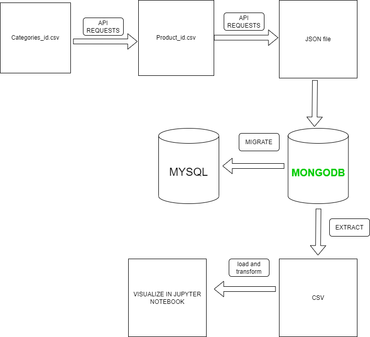

1. Lấy **toàn bộ** sản phẩm đang hiển thị trên các danh mục của website tiki.vn. Dữ liệu lấy về sẽ lưu trong MongoDB
2. Tạo một bản sao lưu data gửi cho Coach để có thể Restore dữ liệu trên một hệ thống MongoDB khác
3. Trích xuất các trường thông tin sau và lưu vào MySQL để cho team khác sử dụng:
    1. Product name: Tên sản phẩm 
    2. Short description: Mô tả ngắn của sản phẩm
    3. Description: Mô tả chi tiết sản phẩm. Yêu cầu: **clean dữ liệu, lọc bỏ những tag html thừa trong mô tả**
    4. URL: Link sản phẩm
    5. Rating: Đánh giá trung bình về sản phẩm
    6. Số lượng bán
    7. Giá sản phẩm
    8. Category ID: ID của danh mục sản phẩm
    9. day_ago_created 
4. Thống kê:
    1. Mỗi category (bao gồm cả sub-category) có bao nhiêu sản phẩm
    2. Tạo biểu đồ thống kê xuất xứ của các sản phẩm. Ví dụ từ biểu đồ có thể biết: Có bao nhiêu sản phẩm xuất xứ từ Trung Quốc. Từ đó so sánh tỉ lệ xuất xứ của các sản phẩm
    3. Top 10 sản phẩm được bán nhiều nhất, có rating cao nhất và giá thấp nhất
5. Lấy tất cả sản phẩm mà có thông tin “thành phần” trong mô tả. Lưu các thông tin dưới dạng CSV: product_id, ingredient.
Lưu ý, chỉ trích chọn ra thông tin miêu tả “Thành phần” trong Description, những thông tin khác không lấy. Thời gian truy vấn ra các sản phẩm có “Thành phần” trong Description phải nhanh nhất có thể
6. Đưa ra idea cho leader về việc mình có thể làm gì tiếp theo với những dữ liệu này

Yêu cầu bổ sung:

1. Download **toàn bộ** ảnh ở “base_url” của các sản phẩm trong danh mục “Thời trang nam” và “Thời trang nữ” về lưu trong ổ cứng (mỗi sản phẩm có từ 3-5 ảnh). Format tên ảnh: productID_number. Ví dụ tên ảnh thứ nhất của sản phẩm 180001095 sẽ là 180001095_1.png. Thông tin đường dẫn ảnh của mỗi product được ghi thêm vào MySQL
2. Change data capture - CDC data từ MongoDB sang MySQL, bất kỳ thông tin được thêm sửa xoá ở MongoDB sẽ được capture sang MySQL. 
    
    Hướng dẫn: Tự nghiên cứu và thiết kế luồng dữ liệu theo keyword CDC hoặc sử dụng một third party như Debezium hoặc Estuary
    
3. Viết Procedure trong MySQL để tự động tính và tạo ra thêm cột
    1. Thông tin tổng số tiền bán được của một sản phẩm 
    2. Ngày tháng năm sản phẩm đó được tạo ra

[**Gợi ý nếu bạn gặp khó khăn**](https://www.notion.so/G-i-n-u-b-n-g-p-kh-kh-n-978389be1de8482c930984d0ffe30dbb?pvs=21)

RUN PROJECT

cmd: py app

